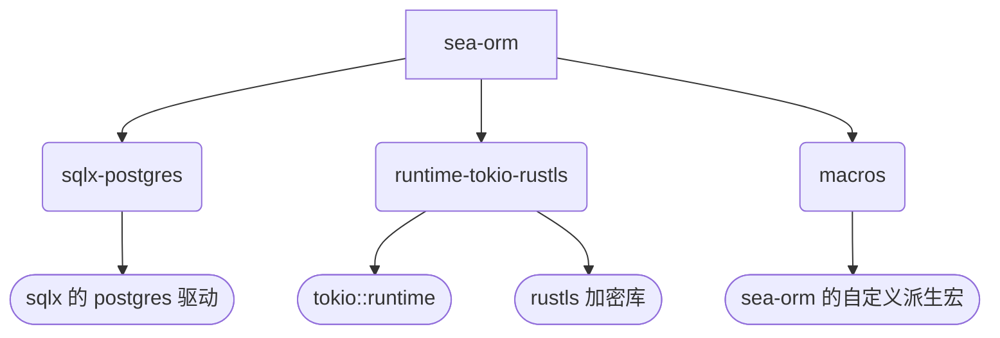
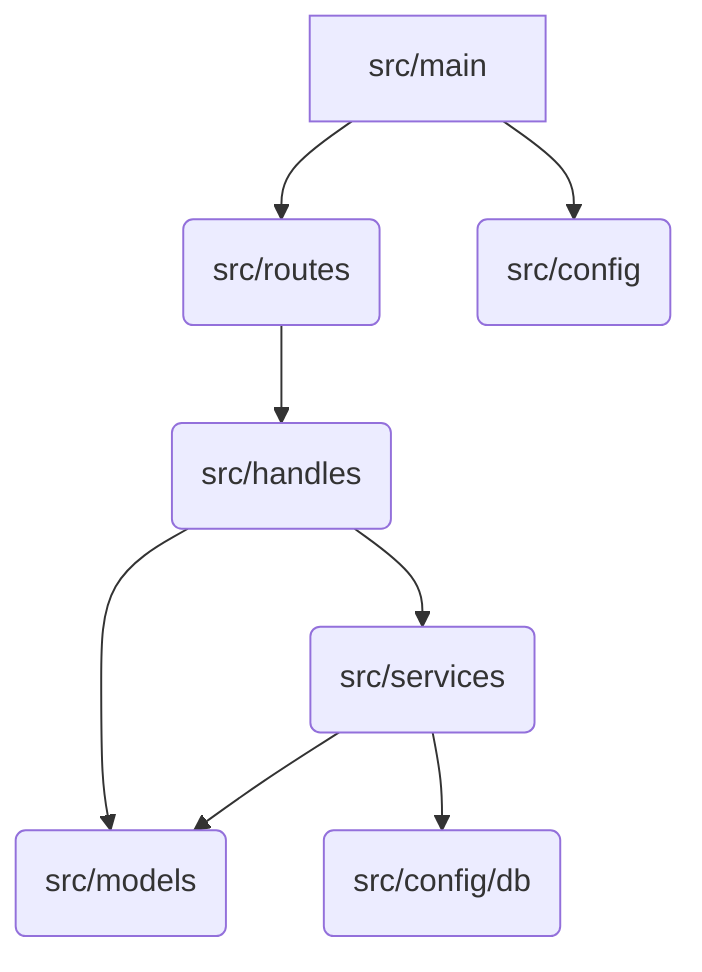

rust-hichat-api

## structure
```
.
├── Cargo.lock // 相关依赖，版本锁定
├── Cargo.toml // 依赖文件
├── README.md  // 项目说明
├── benches    // 基准测试
├── migrations // 数据库迁移相关
├── src        // 项目核心
│   ├── config  //配置相关
│   │   ├── database.rs  // db配置
│   │   └── mod.rs       // 对外使用声明
│   ├── entities               // 数据库表结构相关
│   │   ├── mod.rs       // 对外使用声明
│   │   └── users.rs     // 表结构
│   ├── handlers               // api控制器
│   │   ├── mod.rs       // 对外使用声明
│   │   └── users_handlers.rs //user api 控制
│   ├── main.rs                // 程序入口
│   ├── lib.rs                 // 项目模块聚集
│   ├── middleware             //中间件相关
│   ├── models                 // api 请求和响应数据结构
│   │   ├── mod.rs       // 对外使用声明
│   │   └── users.rs      
│   ├── routes                 // api 路由配置
│   │   ├── app_router.rs
│   │   ├── mod.rs
│   │   └── user_router.rs
│   ├── services               // 核心业务
│   │   ├── mod.rs
│   │   └── user_service.rs
│   └── utils                  // 工具类
├── target                           // 依赖相关

```

## 项目依赖
Cargo.toml 是 Rust 项目的核心配置文件，相当于：
 * 项目身份证（元数据）
 * 依赖管理器（第三方库声明）
 * 构建指令集（编译参数）

### 外部依赖
在项目下我们可以看到有Cargo.toml和Cargo.lock文件，第一个就是用来做依赖导入的，第二个就是我们根据toml文件加载的一个版本lock了，可以来简单说说toml文件：
```rust
[package]
name = "rust-hichat-api"
version = "0.1.0"
edition = "2024"
authors = ["iceymoss"]

# 命令行工具
[[bin]]
name = "icey-cli"
path = "src/bin/cli.rs"

# web服务
[[bin]]
name = "web"
path = "src/main.rs"

# 测试工具
[[bin]]
name = "testing"
path = "src/test/test.rs"

[lib]
path = "src/lib.rs" # 多个入口，必须存在这个文件

[dependencies]
# Axum 相关
axum = "0.7"
tokio = { version = "1.0", features = ["full"] }
tower = "0.4"
tower-http = { version = "0.5", features = ["trace"] }  # 中间件（日志、CORS等）
```

下面我们来介绍各个模块：
#### package
这个我们可以理解为元数据包
```rust
[package]
name = "rust-hichat-api"    # 项目名称（必须全小写）, 在我们项目的各个模块之间导入，也可以基于他来起始点，这里需要注意，在项目内容模块导入时会变成rust-hichat-api
version = "0.1.0"           # 语义化版本号
edition = "2024"            # Rust 版本（推荐最新）
authors = ["iceymoss"]      # 开发者列表（可选）
```

一些补充：
```rust
description = "高性能聊天API"  # 项目简介
license = "MIT"              # 开源协议
repository = "https://github.com/iceymoss/rust-hichat-api" # 代码仓库
```

#### bin
构建目标入库配置，这个配置就是我们给项目配置程序入库，下面的配置中我们指定了3个程序入口
```rust
# 二进制入口（可多个）
[[bin]]
name = "web"               # 可执行文件名（生成在target/debug/）
path = "src/main.rs"       # 入口文件路径

[[bin]]
name = "icey-cli"
path = "src/bin/cli.rs"

# 库文件配置（必须存在）
[lib]
path = "src/lib.rs"        # 库入口文件，这个很重要，我们内部的各个模块之间存在导入关系时，需要这里来提供对外导入声明
```

#### dependencies
dependencies 就是我们的依赖管理了，比如说我们导入了各个开源库，或者我们自己一些内部公共库等
```rust
[dependencies]
# 基础写法（自动选择最新兼容版本）
axum = "0.7" 

# 带特性的依赖
tokio = { 
    version = "1.0", 
    features = ["full"]  # 启用所有功能
}

# 多特性依赖（数据库示例）
sea-orm = { 
    version = "0.12",
    features = [
        "sqlx-postgres",      # 使用PostgreSQL驱动
        "runtime-tokio-rustls", # 异步运行时
        "macros"             # 启用宏支持
    ]
}

# 开发依赖（测试/构建工具）
[dev-dependencies]
mockito = "1.0"  # 仅用于测试环境
```

#### 特性（Features）的作用
按需加载功能模块
减少编译体积
示例：tokio 的常见特性
我们再来看看：
```rust
sea-orm = { 
    version = "0.12",
    features = [
        "sqlx-postgres",      # 使用PostgreSQL驱动
        "runtime-tokio-rustls", # 异步运行时
        "macros"             # 启用宏支持
    ]
}
```

Cargo 执行步骤：
```rust
cargo build
├─ 解析 Cargo.toml
├─ 生成依赖树（Dependency Graph）
├─ 下载 crates 到 ~/.cargo/registry/
├─ 条件编译（Feature Gates）
└─ 生成最终二进制
```

结构如何：




### 内部依赖
这里内部依赖是我自己理解的，就是我们项目各个模块或者目录之间的导入，值得注意的是每一个目录下如果需要对外使用都需要添加一个mod.rs文件作为改目录下的文件导出，来看一个示例：
```rust
.
├── bin
│   └── cli.rs // 程序入口
├── commands
│   ├── hello
│   │   ├── hello.rs 
│   │   └── mod.rs // 对hello目录当前层级下所有需要导出的.rs文件声明， 这里也就是把hello.rs导出
│   ├── mod.rs           // 对commands目录当前层级下所有需要导出的.rs文件声明, 这里也就是把hello，netstatus和ping下的mod.rs导出
│   ├── netstatus
│   │   ├── cn
│   │   │   ├── cn_status.rs
│   │   │   └── mod.rs // 对cn_status.rs导出
│   │   ├── mod.rs // 对cn和netstatus.rs导出
│   │   └── netstatus.rs
│   └── ping
│       ├── check.rs
│       └── mod.rs // 对ping目录当前层级下所有需要导出的.rs文件声明  这里也就是把check.rs导出
```

我们可以看一下src/commands/mod.rs和src/commands/ping/mod.rs
src/commands/mod.rs
```rust
pub mod ping; // 导出ping， 这样在外部/src下的任何地方可以使用ping, 在本mod中也可以使用ping模块了
pub mod hello; // 导出hello

use clap::{Parser, Subcommand};
use anyhow::Result;

#[derive(Parser)]
#[command(name = "icey-cli")]
#[command(about = "网络工具集", version = "0.1.0")]
pub struct Cli {
    #[command(subcommand)]
    pub command: Commands,
}

#[derive(Subcommand)]
pub enum Commands {
    #[command(name = "check", about = "ICMP连通性测试")]
    Ping(ping::PingCommand),
    
    #[command(name = "hello", about = "打招呼")]
    Hello(hello::Hello),
}

// 统一执行接口
impl Commands {
    pub async fn execute(&self) -> Result<()> {
        match self {
            Commands::Ping(cmd) => cmd.run().await,
            Commands::Hello(cmd) => {cmd.run().await}
        }
    }
}
```

再看看src/commands/ping/mod.rs
```rust
pub mod check; //导出check, 这里的作用域只对src/commands/ping/下有效，对外使用的话，需要在src/commands/mod.rs中使用pub mod ping
use crate::commands::ping::check::ping_target;

use clap::Args;
use anyhow::Result;

#[derive(Args)]
pub struct PingCommand {
    /// 目标地址（域名或IP）
    #[arg(
        required = true,
        short = 'H',       // 自定义短选项为 -H
        long = "host"      // 自定义长选项为 --host
    )]
    pub target: String,

    /// 设置超时时间（单位：毫秒）
    #[arg(
        short = 'T',       // 短选项改为 -T
        long = "timeout",  // 长选项保持有意义
        default_value_t = 3000,  // 修改默认值
        value_parser = parse_timeout  // 添加自定义校验
    )]
    pub timeout: u64,

    /// 设置探测次数
    #[arg(
        short = 'n',       // 使用 -n 代替默认的 -c
        long = "number",   // 长选项更明确
        default_value_t = 20,
        value_parser = clap::value_parser!(u32).range(1..=20)  // 限制范围
    )]
    pub count: u32,
}

// 自定义校验函数
fn parse_timeout(s: &str) -> Result<u64, String> {
    let timeout = s.parse().map_err(|_| "必须输入数字".to_string())?;
    if timeout < 100 {
        Err("超时时间不能小于100ms".to_string())
    } else {
        Ok(timeout)
    }
}

impl PingCommand {
    pub async fn run(&self) -> Result<()> {
        // 参数校验
        if self.count == 0 {
            anyhow::bail!("请求次数必须大于0");
        }

        // 调用核心逻辑
        ping_target(
            &self.target,
            self.timeout,
            self.count
        ).await
    }
}
```
这里来一个简单中间，其实就是各个模块不断的套娃，一级一级的向上级目录的mod.rs做导出操作，然后在相应的同级目录或者.rs中就可以使用他们导出来的模块了,
再来看那一下这个we服务的到模块流程，比如我们的一个api接口调用流程


这里就就会存在： 
* main导入了config模块，router模块
* router模块导入handles模块
* handles导入models, services模块
* services模块导入model模块，config模块

所以我们在src/lib中到统一导出
```rust
// src/lib.rs
//使用 lib.rs 作为模块聚合点
// 需要对外使用的model在这里导出
pub mod commands;  // 导出 commands 模块
pub mod config;  // 导出 config 模块
pub mod entities;
pub mod handlers;
pub mod models;
pub mod routes;
pub mod services;
```

这样我们在main中导入就是以这种项目.toml名称方式：
```rust
use rust_hichat_api::routes::app_router::AppRouter;
use rust_hichat_api::routes;
use rust_hichat_api::config;

#[tokio::main]
async fn main() {
    // 初始化数据库
    let db_init_result = config::database::init_db().await;
    match db_init_result {
        Ok(_) => (),
        Err(e) => {
            eprintln!("Database init failed: {}", e);
            return;
        }
    }
    
    let router = routes::user_router::user_routes(AppRouter::new().router);
    
    println!("Listening on http://0.0.0.0:3000");
    // 启动服务器
    let server_result = axum::serve(
        tokio::net::TcpListener::bind("0.0.0.0:3000").await.unwrap(),
        router
    ).await;

    match server_result {
        Ok(_) => (),
        Err(e) => eprintln!("Server error: {}", e)
    }
}
```

在routes目录user_router.rs中，我们就直接以```use crate::handlers::users_handlers;```导入非入库目录模块：
```rust
use axum::{routing::post, Router};
use axum::routing::{delete, get, put};

use crate::handlers::users_handlers;

pub fn user_routes(router: Router) -> Router {
    let router = router.route("/ping", get(users_handlers::ping));
    router.nest("/api/users",
                Router::new()
                    // 创建用户（POST /api/users）
                    .route("/", post(users_handlers::create_user))
                    // 获取用户列表（GET /api/users?page=1&size=10）
                    .route("/", get(users_handlers::list_users))
                    // 获取单个用户（GET /api/users/{id}）
                    .route("/:id", get(users_handlers::get_user))
                    .route("/:id", delete(users_handlers::delete_user))
                    .route("/:id", put(users_handlers::update_user))
    )
}
```

在handles中的users_handlers.rs:
```rust
use axum::extract::{Path, Query};
use axum::http::StatusCode;
use axum::Json;
use sea_orm::DbErr;
use crate::{
    models::users::{CreateUserRequest, UserResponse},
    models::users::{ListRequest, ListResponse, UpdateUserRequest},
    services::user_service::UserService,
};

use crate::models::users::PingResp;

// 不使用模式匹配解构 State
// 不使用模式匹配解构 Json
pub async fn create_user(payload: axum::Json<CreateUserRequest>) -> Result<axum::Json<UserResponse>, (axum::http::StatusCode, String)> {
    // 显式获取服务需要的参数
    let request_data = payload.0;  // 从 Json 解包请求体数据

    // 显式处理异步调用
    let service_result = UserService::create_user(request_data).await;

    // 使用 match 代替 map/map_err
    match service_result {
        Ok(user_response) => {
            let json_response = axum::Json(user_response);
            Ok(json_response)
        }
        Err(error) => {
            let error_message = error.to_string();
            Err((axum::http::StatusCode::INTERNAL_SERVER_ERROR, error_message))
        }
    }
}

pub async fn ping() -> Result<Json<PingResp>, (StatusCode, String)> {
    let ping = PingResp {
        success: "pong".to_string(),
    };
    Ok(Json(ping))
}
```
